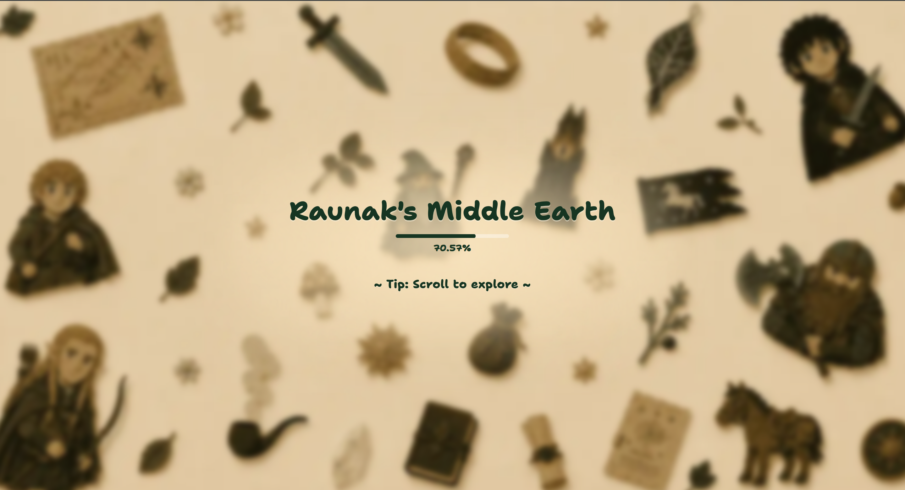
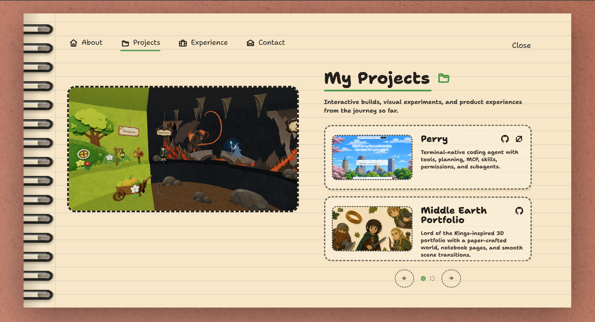

# Middle Earth Portfolio

[Middle Earth Portfolio](https://www.raunakcodes.online/) is a Lord of the Rings-inspired interactive 3D portfolio with a paper-crafted world, notebook-style info pages, and smooth scene transitions.

## Why I built it?

I built Middle Earth Portfolio to make my portfolio feel less like a static resume and more like a tiny world you can explore. I wanted to combine 3D, motion, playful UI, and hand-crafted details into one polished web experience that shows both my engineering taste and my love for building unusual interfaces.

## Tech stack

- TypeScript
- Next.js 16
- React 19
- Tailwind CSS
- Three.js
- React Three Fiber
- Drei
- GSAP / motion-style scene interactions
- Vercel

## Some screens






## Contributing

1. Fork the repo.
2. Clone the forked repo.
3.
```sh
cd new-lotr-portfolio
npm install
```
4.
```sh
npm run dev
```
5. Open [http://localhost:3000](http://localhost:3000) and start exploring.

The development server is now running! Make your code contributions and open some PRs!!!
